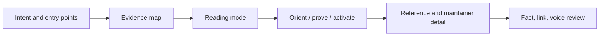

<div align="center">

<sub>🧭 EVIDENCE FIRST · 🎨 VISUAL BY DESIGN · 🌐 BILINGUAL</sub>

# 📝 generate-readme

**Turn repository facts into a README people can understand, run, and trust.**

[🧠 Skill](./SKILL.md) · [📚 References](./references/) · [🇨🇳 简体中文](./README.zh-CN.md) · [📖 Project overview](./README.md)

</div>

## 👥 Who it is for

Use this skill when a real repository needs a README created, rewritten, audited, or localized. It connects evidence gathering, information design, drafting, and newcomer verification into one repeatable path. The goal is a confident first action, not a wall of badges.

## 🚀 Quick start

Copy [`SKILL.md`](./SKILL.md) and [`references/`](./references/) into your coding assistant's skill directory, then state the outcome:

```text
Use generate-readme to rewrite this project's bilingual README.
Lead with the shortest runnable path; use a real output, screenshot, or diagram
to prove the value; trace every command, version, and capability to repository evidence.
```

The result should open with positioning, show one trustworthy proof object, guide a primary setup path, and survive both an evidence pass and a newcomer read.

## 🧭 The workflow



| Stage | Question | Output |
|-------|----------|--------|
| Position | What is this, who does it serve, and what does it enable? | One-sentence positioning |
| Evidence | Can commands, versions, capabilities, and relationships be traced? | Temporary evidence map |
| Design | Which reading rhythm belongs to this project? | Structure and visual mode |
| Writing | How does a new user reach a first successful result? | One coherent primary path |
| Verification | Do facts, links, hierarchy, and voice hold together? | Corrected README |

## 🎛️ Four reading modes

| Mode | Fits | Visual emphasis |
|------|------|-----------------|
| **Minimal** | Libraries, infrastructure, source repositories | Positioning, essential links, short entry |
| **Product** | Applications, developer tools | Real interface, output, or reproducible result |
| **Editorial** | Creative tools, curated collections, education | Headings, examples, and whitespace |
| **Reference-led** | APIs, SDKs, multi-entry CLIs | Choose a path before exact usage |

When several reader paths are real, the skill makes the choice explicit and marks one route as recommended. When there is one path, it keeps the opening linear.

## ⚙️ Adjustable parameters and invariants

For skill or prompt repositories, the README separates safe controls—layout, example depth, language, or output format—from the principles that protect provenance, privacy, and quality. Readers can see what to tune without guessing what the system is allowed to invent.

## 🛡️ Content boundaries

The skill does not read or expose credentials, private environment files, logs, database dumps, dependency directories, build output, or VCS internals. Source, manifests, example configuration, route registration, and maintained docs can support direct claims; naming conventions, an isolated Dockerfile, or incomplete code cannot prove deployment, performance, or compatibility.

## 🗂️ Repository layout

```text
wisdom-readme/
├── SKILL.md                         # workflow and constraints
├── references/
│   ├── design-and-structure.md      # structure, visual language, navigation
│   ├── evidence-and-scan.md         # safe scan and evidence rules
│   └── verification.md              # review checklist
├── README.md                        # bilingual entry point
├── README.zh-CN.md                  # Chinese guide
├── README.en.md                     # English guide
└── LICENSE
```

The root files are the editing source. `.agents/`, `.claude/`, `.codex/`, `.cursor/`, and `.trae/` contain platform copies. Update the root first, then synchronize the copies.

## 📄 License

[Apache License 2.0](./LICENSE)
